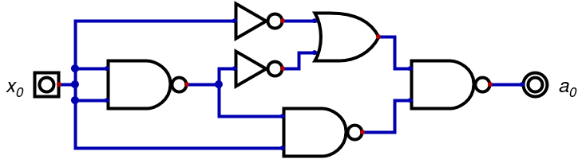
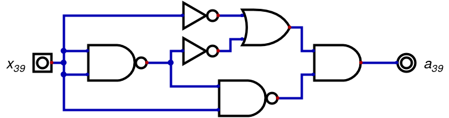
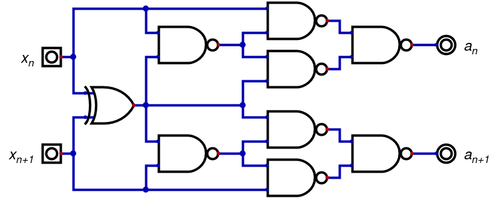
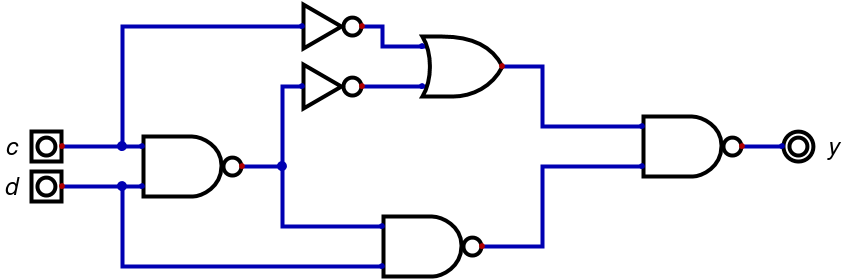
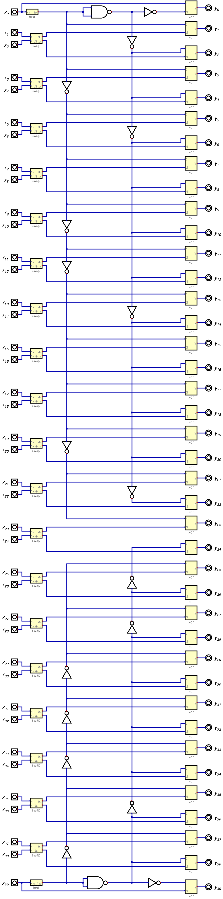

# Quarantaine

Outil utilisé pour simplifier les circuits : https://github.com/hneemann/Digital

On voit que des blocs sont similaires. Simplifions-les.

Le bloc en entrée de x_{0} vaut toujours 0.
```
a_{0} = 0
```


Le bloc en entrée de x_{39} vaut toujours 1.
```
a_{39} = 1
```


Les autres blocs en entrée permettent d'échanger les bits.
```
x_{n} = a_{n+1}
x_{n+1} = a_{n}
```


Les blocs en sortie sont en faites des `xor`.
```
y = c ^ d
```


Il reste plus qu'à faire le reste du circuit.


On récupère l'équation simplifié.
Il reste plus qu'à le programmer dans [quarantaine.c](quarantaine.c).
Bon, seulement la fonction réciproque était necessaire, mais j'y avais pas pensé.
